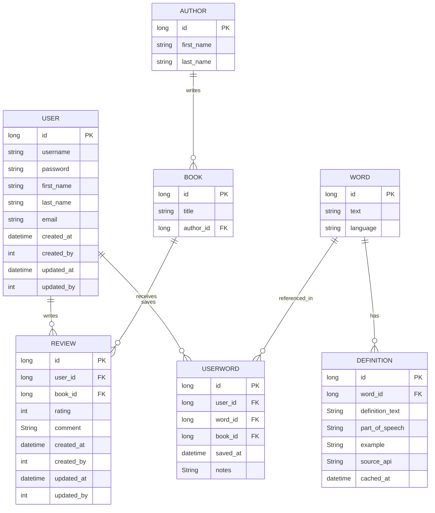
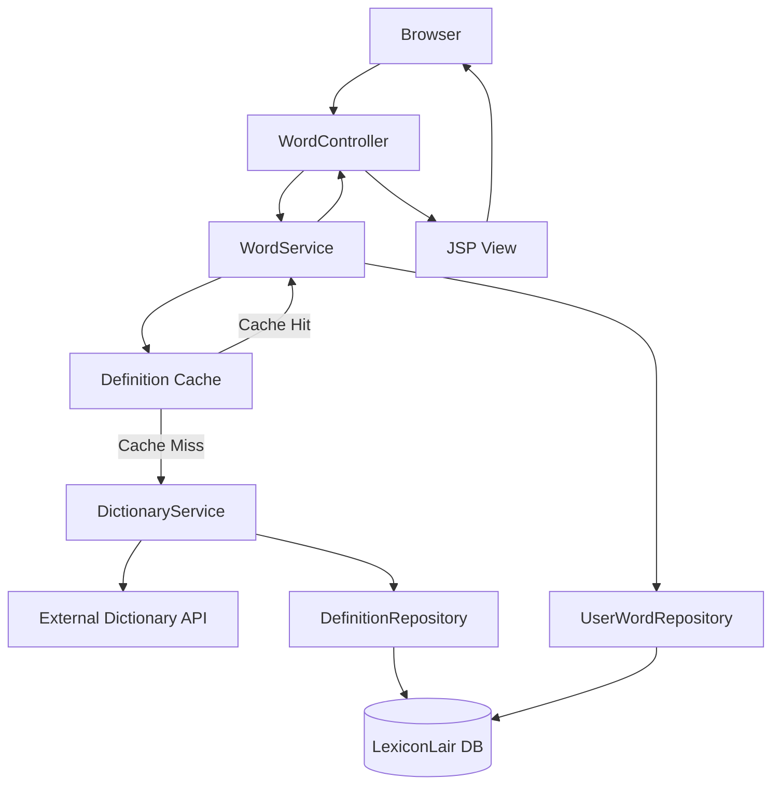

```mermaid
flowchart TD

%% ===== CLIENT =====
    subgraph CLIENT["Client Layer"]
        A[Web Browser]
    end

%% ===== SPRING BOOT APP =====
subgraph APP["Spring Boot MVC Application (port 8080)"]

%% SECURITY
subgraph SECURITY["Security Layer"]
SEC["SpringSecurityConfiguration
        InMemoryUserDetailsManager
Users: ronan, ronan2 (BCrypt)"]
end

%% CONTROLLERS
subgraph CONTROLLER["Controller Layer"]
C1["WelcomeController
GET /"]
C2["WordController
GET  /words
GET  /words/add
POST /words
GET  /words/{id}
GET  /words/{id}/edit
POST /words/{id}/update
GET  /words/{id}/delete"]
C3["BookController
GET  /books
GET  /books/add
POST /books
GET  /books/{id}
GET  /books/{id}/edit
POST /books/{id}/update
GET  /books/{id}/delete"]
C4["AuthorController
GET  /authors
GET  /authors/add
POST /authors
GET  /authors/{id}
GET  /authors/{id}/edit
POST /authors/{id}/update
GET  /authors/{id}/delete"]
C5["UserController
GET  /users
GET  /users/add
POST /users
GET  /users/{id}
GET  /users/{id}/edit
POST /users/{id}/update
GET  /users/{id}/delete"]
C6["ReviewController
GET  /reviews
GET  /reviews/add
POST /reviews
GET  /reviews/{id}/edit
POST /reviews/{id}/update
GET  /reviews/{id}/delete"]
end

%% SERVICES
subgraph SERVICE["Service Layer"]
S1["WordService
saveWordForUser()
getWordDetails()
listWords()"]
S2["BookService"]
S3["AuthorService"]
S4["UserService"]
S5["ReviewService"]
S6["DictionaryService
fetchDefinition(word)
→ dictionaryapi.dev"]
end

%% REPOSITORIES
subgraph REPO["Repository Layer"]
R1["WordRepository
JpaRepository&lt;Word, Integer&gt;"]
R2["DefinitionRepository
JpaRepository&lt;Definition, Integer&gt;"]
R3["UserWordRepository
JpaRepository&lt;UserWord, Integer&gt;"]
R4["BookRepository
JpaRepository&lt;Book, Integer&gt;"]
R5["AuthorRepository
JpaRepository&lt;Author, Integer&gt;"]
R6["UserRepository
JpaRepository&lt;User, Integer&gt;"]
R7["ReviewRepository
JpaRepository&lt;Review, Integer&gt;"]
end

%% ENTITIES
subgraph ENTITY["Domain Entities"]
E1["Word
id, text, language"]
E2["Definition
id, word_id, definition_text
part_of_speech, example
source_api, cached_at"]
E3["UserWord
id, user_id, word_id
book_id, saved_at, notes"]
E4["Book
id, title, author_id"]
E5["Author
id, first_name, last_name"]
E6["User
id, username, password
first_name, last_name
email, created_at"]
E7["Review
id, user_id, book_id
rating, comment, created_at"]
end

%% CACHE
subgraph CACHE["Cache Layer"]
CA["Definition Cache
Redis / in-memory cache"]
end

%% VIEWS
subgraph VIEWS["JSP Views (WEB-INF/jsp)"]
V1[welcome.jsp]
V2[listWords.jsp]
V3[addWord.jsp]
V4[wordDetails.jsp]
V5[listBooks.jsp]
V6[addBook.jsp]
V7[bookDetails.jsp]
V8[listAuthors.jsp]
V9[addAuthor.jsp]
V10[listUsers.jsp]
V11[addUser.jsp]
V12[listReviews.jsp]
V13[addReview.jsp]
end

%% CONFIG
subgraph CONFIG["Configuration"]
CFG["AppConfig
@Bean RestTemplate"]
end
end

%% ===== DATABASE =====
subgraph DATA["Database (single relational DB)"]
DB[("LexiconLair DB
PostgreSQL : 5432
or MySQL : 3306")]
end

%% ===== EXTERNAL =====
subgraph EXT["External Systems"]
EXT1["dictionaryapi.dev
/api/v2/entries/en/{word}"]
end

%% ===== FLOW =====
A -->|"HTTP request"| SEC
SEC -->|"Form login / session"| C1
SEC -->|"Form login / session"| C2
SEC -->|"Form login / session"| C3
SEC -->|"Form login / session"| C4
SEC -->|"Form login / session"| C5
SEC -->|"Form login / session"| C6

C1 --> V1

C2 --> V2
C2 --> V3
C2 --> V4

C3 --> V5
C3 --> V6
C3 --> V7

C4 --> V8
C4 --> V9

C5 --> V10
C5 --> V11

C6 --> V12
C6 --> V13

C2 --> S1
C3 --> S2
C4 --> S3
C5 --> S4
C6 --> S5

S1 --> R1
S1 --> R2
S1 --> R3
S1 --> CA
CA -->|"cache miss"| S6
S6 --> R2

S2 --> R4
S3 --> R5
S4 --> R6
S5 --> R7

R1 -->|"ORM"| E1
R2 -->|"ORM"| E2
R3 -->|"ORM"| E3
R4 -->|"ORM"| E4
R5 -->|"ORM"| E5
R6 -->|"ORM"| E6
R7 -->|"ORM"| E7

E1 --> DB
E2 --> DB
E3 --> DB
E4 --> DB
E5 --> DB
E6 --> DB
E7 --> DB

CFG -->|"provides RestTemplate"| S6
S6 -->|"REST GET"| EXT1

%% ===== STYLING =====
classDef client fill:#e3f2fd,stroke:#1e88e5,stroke-width:2px,color:#000;
classDef security fill:#fff8e1,stroke:#fdd835,stroke-width:2px,color:#000;
classDef controller fill:#fff3e0,stroke:#fb8c00,stroke-width:2px,color:#000;
classDef service fill:#e8f5e9,stroke:#43a047,stroke-width:2px,color:#000;
classDef repo fill:#ede7f6,stroke:#5e35b1,stroke-width:2px,color:#000;
classDef entity fill:#e0f7fa,stroke:#00897b,stroke-width:2px,color:#000;
classDef cache fill:#fffde7,stroke:#f9a825,stroke-width:2px,color:#000;
classDef view fill:#fce4ec,stroke:#e53935,stroke-width:2px,color:#000;
classDef config fill:#f1f8e9,stroke:#7cb342,stroke-width:2px,color:#000;
classDef db fill:#f3e5f5,stroke:#8e24aa,stroke-width:2px,color:#000;
classDef ext fill:#fbe9e7,stroke:#f4511e,stroke-width:2px,color:#000;

class A client;
class SEC security;
class C1,C2,C3,C4,C5,C6 controller;
class S1,S2,S3,S4,S5,S6 service;
class R1,R2,R3,R4,R5,R6,R7 repo;
class E1,E2,E3,E4,E5,E6,E7 entity;
class CA cache;
class V1,V2,V3,V4,V5,V6,V7,V8,V9,V10,V11,V12,V13 view;
class CFG config;
class DB db;
class EXT1 ext;
```

# Design of Lexicon Lair

## Mermaid Script

This is mermaid syntax

## Entity Relationship Diagram

---

## MVC Breakdown

| MVC Tier         | Classes                                                                                                                                    |
|------------------|--------------------------------------------------------------------------------------------------------------------------------------------|
| **Model**        | `User`, `Word`, `Definition`, `Book`, `Author`, `Review`, `UserWord`                                                                       |
| **Services**     | `UserService`, `WordService`, `BookService`, `AuthorService`, `ReviewService`, `DictionaryService`                                         |
| **Repositories** | `UserRepository`, `WordRepository`, `DefinitionRepository`, `BookRepository`, `AuthorRepository`, `ReviewRepository`, `UserWordRepository` |
| **View**         | JSP pages `listWords.jsp` · `addWord.jsp`, etc.                                                                                            |
| **Controller**   | `WordController`, `BookController`, `AuthorController`, `UserController`, `ReviewController`                                               |

> **Note:** Controllers should call a Service, which calls the Repository — not the Repository directly. This keeps business logic out of the Controller and makes each layer independently testable.

---

## Mermaid Script

This is mermaid syntax

