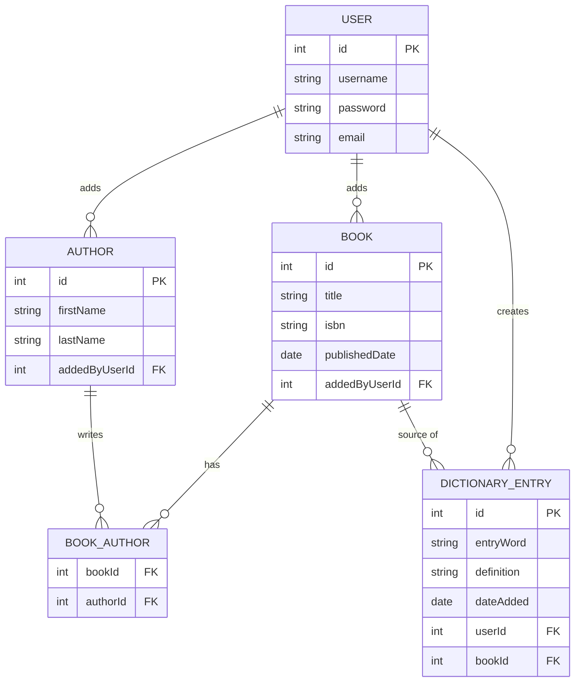
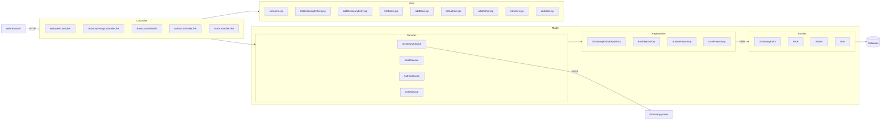
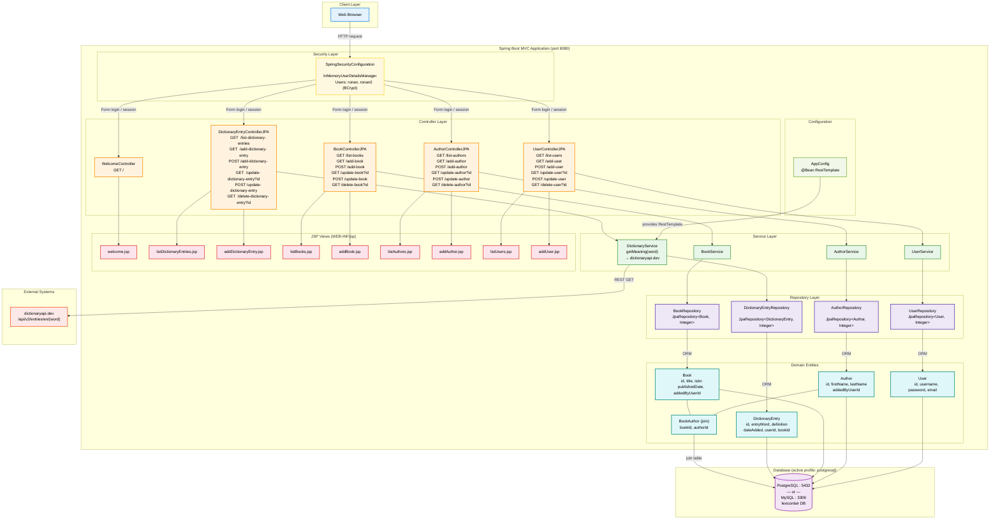

# Design of Lexicon Lair

## Mermaid Script

This is mermaid syntax

## Entity Relationship Diagram

---

## MVC Breakdown

| MVC Tier | Classes |
|---|---|
| **Model** | `User`, `UserRepository`, `UserService` · `Book`, `BookRepository`, `BookService` · `Author`, `AuthorRepository`, `AuthorService` · `DictionaryEntry`, `DictionaryEntryRepository`, `DictionaryService` |
| **View** | `welcome.jsp` · `listBooks.jsp`, `addBook.jsp` · `listAuthors.jsp`, `addAuthor.jsp` · `listUsers.jsp`, `addUser.jsp` · `listDictionaryEntries.jsp`, `addDictionaryEntry.jsp` |
| **Controller** | `WelcomeController`, `BookControllerJPA`, `AuthorControllerJPA`, `UserControllerJPA`, `DictionaryEntryControllerJPA` |

> **Note:** Controllers should call a Service, which calls the Repository — not the Repository directly. This keeps business logic out of the Controller and makes each layer independently testable.

---

## Mermaid Script

This is mermaid syntax

